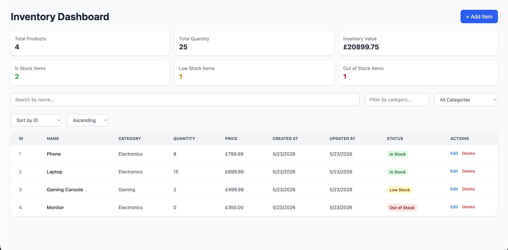
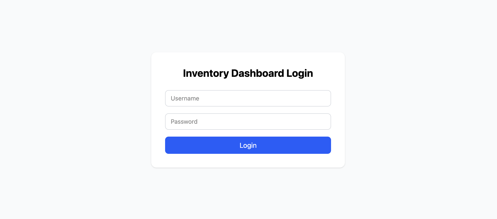
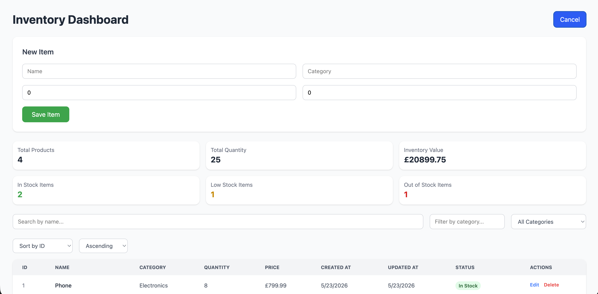
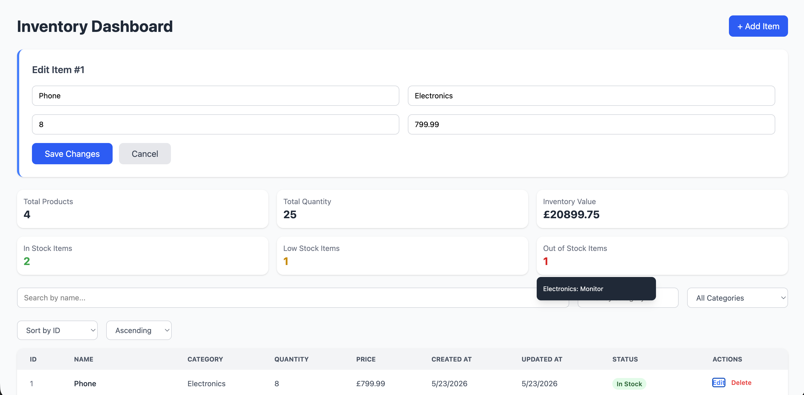

# Inventory Management System

A full-stack inventory management system built with React, FastAPI, PostgreSQL, Docker, Docker Compose and JWT Authentication.

The dashboard provides inventory tracking, analytics, product management, filtering, sorting, and stock monitoring through a responsive frontend interface connected to a REST API backend.

# 在庫管理システム

React、FastAPI、PostgreSQL、Docker、Docker Compose、およびJWT認証を使用して構築されたフルスタックの在庫管理システム。

ダッシュボードは、レスポンシブなフロントエンドインターフェースとREST APIバックエンドを介して、リアルタイムの在庫追跡、分析、製品管理、フィルタリング、ソート、在庫監視機能を提供します。

---

### Screenshots

<table>
  <tr>
    <td>
      
      <br/>
      <strong>Dashboard Overview</strong>
    </td>
    <td>
      
      <br/>
      <strong>Login Page</strong>
    </td>
  </tr>
  <tr>
    <td>
      
      <br/>
      <strong>Add New Item</strong>
    </td>
    <td>
      
      <br/>
      <strong>Edit Item</strong>
    </td>
  </tr>
</table>

---

## Live Demo

Frontend Dashboard: `https://inventory-management-system-iris408.vercel.app/`
Backend API Docs: `https://inventory-management-system-1wcw.onrender.com/docs`

The frontend is deployed on Vercel and connected to a FastAPI backend deployed on Render with PostgreSQL database storage.
---

## Current Status

| Area | Status |
|---|---|
| React + TypeScript frontend | ✅ Complete |
| FastAPI backend | ✅ Complete |
| PostgreSQL database integration | ✅ Complete |
| CRUD operations | ✅ Complete |
| JWT login flow | ✅ Complete |
| Protected inventory routes | ✅ Complete |
| Authenticated frontend CRUD requests | ✅ Complete |
| Frontend and Backend Docker support | ✅ Complete |
| Render backend deployment | ✅ Complete |
| Vercel frontend deployment | ✅ Complete |
| Frontend/backend production integration | ✅ Complete |
| CI/CD pipeline | ✅ Complete  |
| AWS deployment | 🚧 In progress |

## Recent Update

### English

The Inventory Management System is now deployed as a complete full-stack application. The React and TypeScript frontend is hosted on Vercel, while the FastAPI and PostgreSQL backend is hosted on Render.

This update confirms live frontend/backend integration, deployed authentication, protected inventory routes and production CRUD functionality.

### 日本語

在庫管理システムは、完全なフルスタックアプリケーションとしてデプロイされました。ReactとTypeScriptで構築されたフロントエンドはVercelでホストされ、FastAPIとPostgreSQLで構成されたバックエンドはRenderでホストされています。

今回のアップデートにより、フロントエンドとバックエンドの統合、認証機能、保護された在庫管理ルート、および本番環境でのCRUD機能が確認されました。

### Recent Deployment Fixes
- Replaced hardcoded frontend API URL with `VITE_API_URL`
- Normalised API URL handling to prevent double-slash endpoint errors
- Configured Render backend environment variables
- Updated CORS settings to allow Vercel frontend URL
- Fixed Render backend database session dependency with `get_db`
- Confirmed deployed FastAPI`/docs` route works
- Fixed frontend login request format using `application/x-www-form-urlencoded
- Confirmed deployed frontend connects to deployed backend

---

## Features

| Backend | Frontend |
|---|---|
| REST API CRUD operations | React + TypeScript inventory dashboard |
| PostgreSQL database integration | Responsive Tailwind CSS UI |
| SQLAlchemy ORM | Search and category filtering |
| JWT Authentication | Sorting controls |
| Protected inventory routes | Analytics cards |
| Created/updated timestamps | Real-time API integration |
| Docker and Docker Compose support | Add/Edit/Delete item functionality |
| Render backend deployment | Loading and error handling |
| RESTful API architecture | Vercel frontend deployment |

---

## Authentication Notes / 認証につて

### English

Inventory routes are protected and require a valid JWT token. 
The frontend stores the token after login and send it with protected requests using the `Authorization` header:
```text
Authorization: Bearer <token>
```
This allows authenticated users to securely load, add, edit, update and delete inventory items from the dashboard.

### 日本語

在庫管理ルートは保護されており、有効なJWTアクセストークンが必要です。
ログイン後、フロントエンドはトークンを保存し、保護されたAPIリクエスト時に Authorization ヘッダーへ付与して送信します。
```text
Authorization: Bearer <トークン>
```
これにより、認証済みユーザーはデプロイ済みのフロントエンドダッシュボードから、在庫アイテムの取得、追加、編集、更新、削除を安全に実行できます。

---

# Local Deployment /  ローカル開発

## Docker Ports / Dockerポート

| Service | Local URL |
| --- | --- |
| Frontend | http://localhost:5173 |
| Backend API | http://localhost:8000 |
| Swagger UI | http://localhost:8000/docs |
| PostgreSQL | localhost:5433 |

# Installation
Clone repository /リポジトリのクローン

```bash
git clone https://github.com/Iris408/inventory-management-system.git
cd inventory-management-system
```

## Enviroments Variables / 環境変数
### Backend
Create an .env file inside the backend folder:
```bash
DATABASE_URL=postgresql://inventory_user:inventory_password@db:5432/inventory_db
SECRET_KEY=your_secret_key_here
CORS_ORIGINS=http://localhost:5173,http://localhost:5174
```

### Frontend
Create an .env file inside the frontend folder:
```bash
cd frontend
VITE_API_URL=http://localhost:8000
```

## Run with Docker
From the project root:
```bash
docker-compose up --build
```
If `docker compose` does not work, try:
```bash
docker-compose up --build
```
This starts the backend API and PostgreSQL database.

## Run Locally / ローカル起動
Open a new terminal:
```bash
cd frontend
npm install
npm run dev
```
Then open:
`http://localhost:5173`

## Usage / 使い方
1. Start the backend and PostgreSQL database with Docker.
2. Start the React frontend locally.
3. Open the inventory dashboard in the browser.
4. Register or log in to receive a JWT access token.
5. Use the dashboard to create, edit, update, and delete inventory items.
6. Use analytics cards, filtering, and sorting controls to manage inventory data.