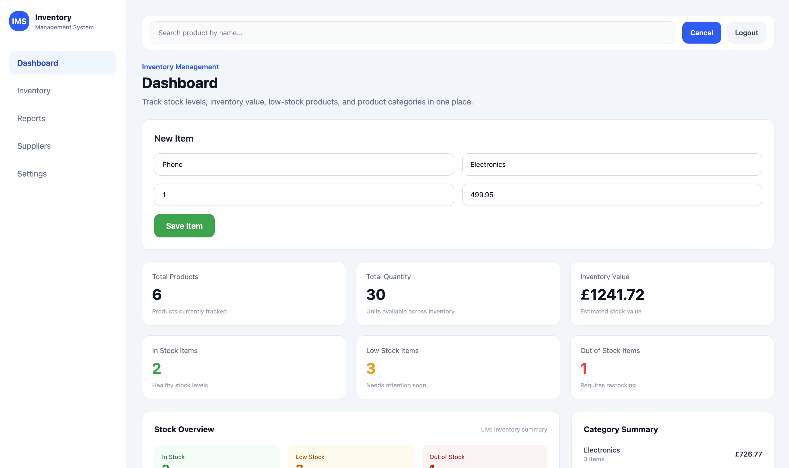
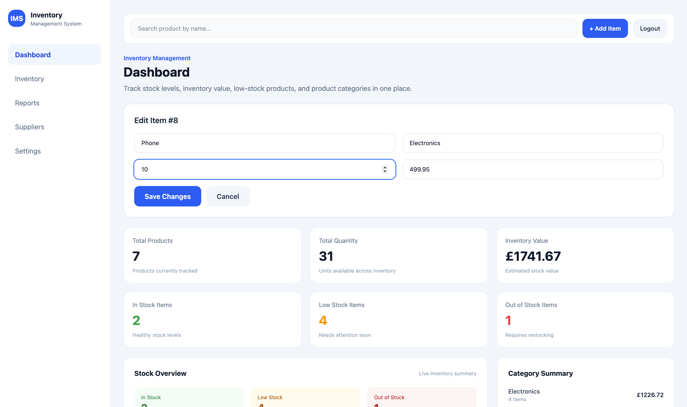

# Inventory Management System

A full-stack inventory dashboard built with React, TypeScript, Tailwind CSS, FastAPI, PostgreSQL, Docker, and GitHub Actions CI.

The app allows users to manage inventory items, track stock levels, view inventory value, search/filter/sort products, and monitor low-stock or out-of-stock items through an admin-style dashboard UI.

## Live Demo

Frontend:

- [Inventory Dashboard](https://inventory-management-system-iris408.vercel.app/)

Backend API:

- [Backend Root Endpoint](https://inventory-management-system-1wcw.onrender.com/)
- [Swagger API Docs](https://inventory-management-system-1wcw.onrender.com/docs)

## Current Status

| Area | Status |
| --- | --- |
| React / TypeScript frontend | ✅ Complete |
| FastAPI backend | ✅ Complete |
| PostgreSQL database | ✅ Connected |
| Inventory CRUD | ✅ Working |
| Search / filter / sort | ✅ Working |
| Stock status tracking | ✅ Working |
| Dashboard analytics | ✅ Working |
| Docker support | ✅ Complete |
| GitHub Actions CI | ✅ Complete |
| Deployment | ✅ Live |

## Features

- Full-stack inventory dashboard
- User login and authenticated dashboard access
- Create, view, edit, and delete inventory items
- Search products by name
- Filter products by category
- Sort products by ID, price, or quantity
- Track stock status: in stock, low stock, and out of stock
- Dashboard summary cards for product count, quantity, stock status, and inventory value
- Category summary and recent items panels
- Responsive admin dashboard layout
- Swagger API documentation
- Backend, frontend, and Docker CI workflows

## Tech Stack

### Frontend

- React
- TypeScript
- Vite
- Tailwind CSS
- Fetch API
- Local storage token handling

### Backend

- Python
- FastAPI
- PostgreSQL
- SQLAlchemy
- Uvicorn
- JWT authentication
- REST API

### DevOps / Tooling

- Docker
- Docker Compose
- GitHub Actions
- Git / GitHub
- Render
- Vercel

## Screenshots

| Dashboard Overview | Add Item Form | Edit Item Form |
| --- | --- | --- |
|  |  |  |

| Search / Filter / Sort | Mobile Dashboard | Swagger API Docs |
| --- | --- | --- |
|  |  |  |

## Quick Start

Clone the repository:

```bash
git clone https://github.com/Iris408/inventory-management-system.git
cd inventory-management-system
```

Run with Docker Compose:

```bash
docker compose up --build
```

Backend API:

```text
http://127.0.0.1:8000/docs
```

Frontend:

```text
http://localhost:5174
```

## Documentation

More detailed project documentation is available in the `docs/` folder.

| Document | Description |
| --- | --- |
| [Setup Guide](./docs/setup.md) | Environment variables, local setup, Docker setup, and test commands |
| [API Reference](./docs/api-reference.md) | Authentication, inventory, and analytics endpoints |
| [Project Details](./docs/project-details.md) | Architecture, dashboard refresh notes, limitations, future improvements, and learning notes |

## Project Summary

Inventory Management System is a full-stack dashboard project built to practise realistic CRUD workflows, authenticated API requests, PostgreSQL integration, dashboard UI design, Docker-based development, deployment, and CI/CD workflow checks.

## Author

Built by Iris408