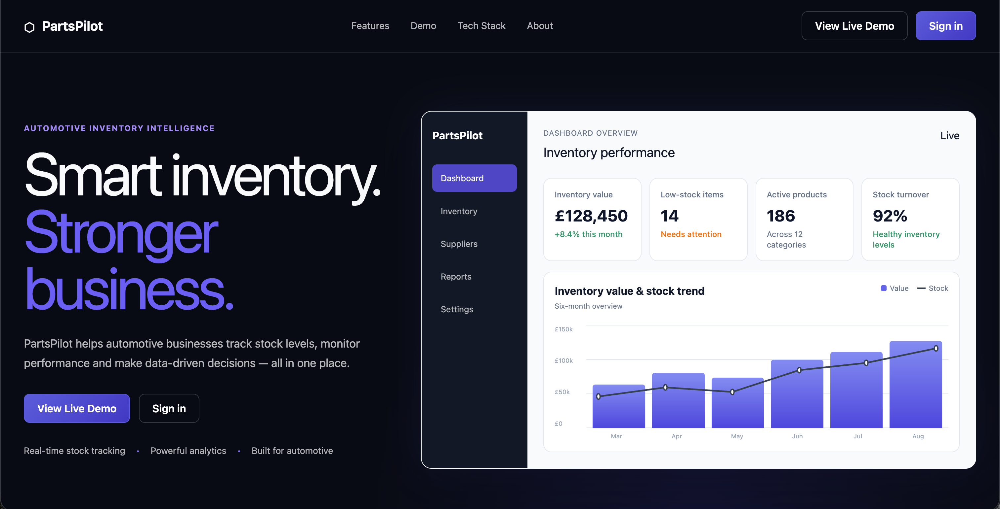
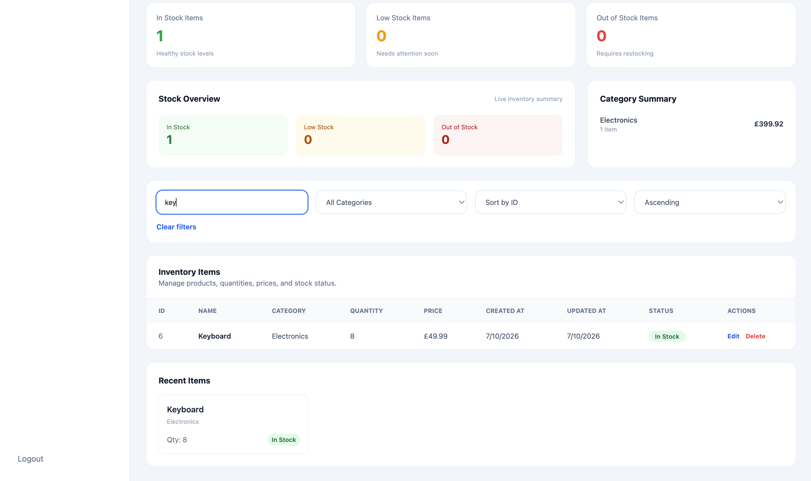
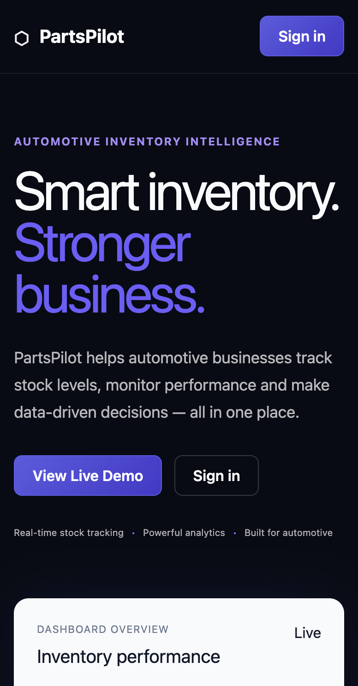
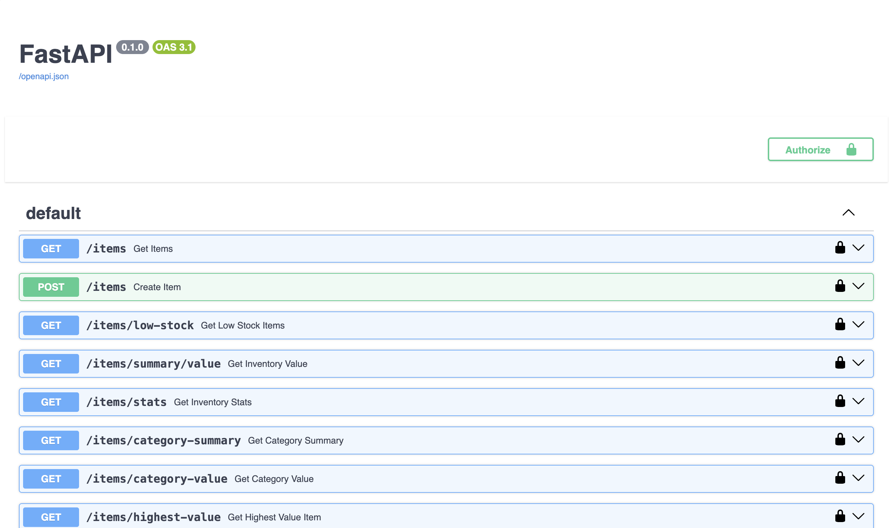
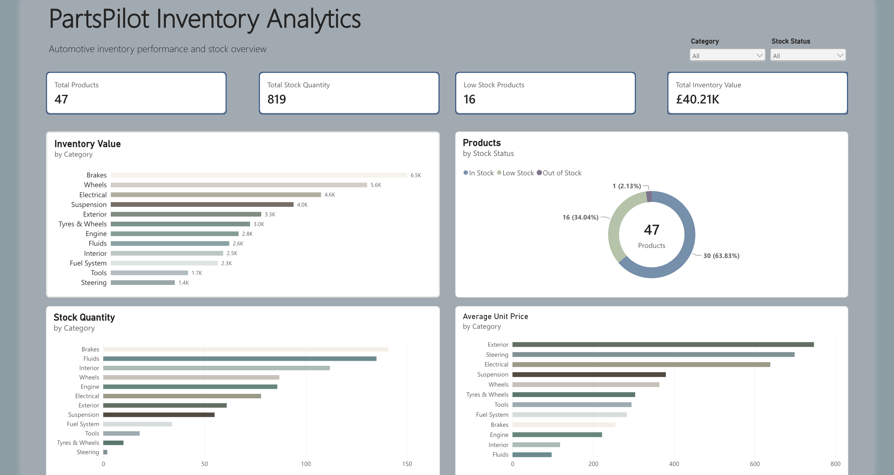

# PartsPilot

### Automotive Inventory Management & Analytics Platform

PartsPilot is a production-style full-stack inventory platform built with FastAPI, PostgreSQL, React, TypeScript, Docker, and Power BI.

It provides authenticated inventory management, stock monitoring, operational analytics, and business intelligence across an automotive parts dataset.

## Key Features

- Authenticated inventory management
- Create, view, update, and delete inventory items
- Search, filtering, sorting, and pagination
- In-stock, low-stock, and out-of-stock tracking
- Inventory value and category analytics
- Dashboard summary metrics
- PostgreSQL-backed automotive inventory dataset
- Power BI reporting and analytics
- Swagger/OpenAPI documentation
- Docker Compose development environment
- Backend, frontend, and Docker CI

## Current Status

**Core full-stack platform: Complete and deployed** ✅

PartsPilot is available as a live demonstration with a sample automotive inventory dataset.

The Power BI analytics dashboard is complete. Current development is focused on final frontend polish, completing the remaining application pages, and expanding automated test coverage before PartsPilot moves primarily into maintenance.

| Area | Status |
| --- | --- |
| Full-stack application | ✅ Complete |
| PostgreSQL database | ✅ Connected |
| JWT authentication | ✅ Working |
| Inventory management | ✅ Working |
| Application analytics | ✅ Working |
| Docker Compose | ✅ Working |
| GitHub Actions CI | ✅ Working |
| Deployment | ✅ Live |
| Power BI dashboard | ✅ Complete |

## Live Demo

| Service | Link |
| --- | --- |
| Frontend | [PartsPilot Dashboard](https://inventory-management-system-iris408.vercel.app/) |
| Backend API | [PartsPilot API](https://inventory-management-system-1wcw.onrender.com/) |
| Swagger Docs | [API Documentation](https://inventory-management-system-1wcw.onrender.com/docs) |

> The deployed URLs retain the project's original Inventory Management System hostname.

### Demo Account

| Field | Credential |
| --- | --- |
| Username | `demo_recruiter` |
| Password | `InventoryDemo2026!` |

The demo account uses sample inventory data and is intended for portfolio demonstration.

## Technology Stack

| Area | Technologies |
| --- | --- |
| Frontend | React, TypeScript, Vite, Tailwind CSS |
| Backend | Python, FastAPI, SQLAlchemy, JWT |
| Database | PostgreSQL |
| Analytics | Power BI |
| Infrastructure | Docker, Docker Compose |
| CI/CD | GitHub Actions |
| Deployment | Render, Vercel |

## Architecture

```text
React + TypeScript
        │
        │ REST API
        ▼
     FastAPI
        │
     SQLAlchemy
        │
        ▼
   PostgreSQL
        │
        ▼
     Power BI
```

The React application communicates with the FastAPI REST API, while SQLAlchemy provides the persistence layer over PostgreSQL.

Power BI provides a separate reporting and business intelligence layer over PartsPilot's inventory data.

For a more detailed technical breakdown, see the [Project Details](./docs/project-details.md).

## Screenshots

| Dashboard | Inventory Management | Mobile | API |
| --- | --- | --- | --- |
|  |  |  |  |

### Power BI Inventory Analytics



## Quick Start

Clone the repository:

```bash
git clone https://github.com/Iris408/partspilot.git
cd partspilot
```

Start the application with Docker Compose:

```bash
docker compose up --build
```

Services are then available at:

| Service | URL |
| --- | --- |
| Frontend | `http://localhost:5174` |
| API | `http://localhost:8000` |
| Swagger | `http://localhost:8000/docs` |

For local development and configuration, see the [Setup Guide](./docs/setup.md).

## Testing and CI

GitHub Actions validates the backend, frontend, and Docker environment on pushes and pull requests.

Current workflows cover:

- Backend automated tests
- Frontend production build
- Docker build validation

Run backend tests locally:

```bash
cd backend
pytest
```

Run the frontend production build:

```bash
cd frontend
npm run build
```

## Project Structure

```text
partspilot/
├── backend/
├── frontend/
├── powerbi/
├── docs/
├── screenshots/
├── .github/workflows/
├── docker-compose.yml
├── LICENSE
└── README.md
```

## Documentation

Detailed engineering documentation is available in [`docs/`](./docs/).

| Document | Description |
| --- | --- |
| [Setup](./docs/setup.md) | Local development, environment configuration, Docker, and testing |
| [API Reference](./docs/api-reference.md) | Authentication, inventory, and analytics endpoints |
| [Project Details](./docs/project-details.md) | Architecture, implementation decisions, limitations, and future development |

Power BI-specific documentation is maintained in [`powerbi/`](./powerbi/).

## Roadmap

Current development priorities:

- Complete the Power BI analytics dashboard
- Expand operational reporting
- Increase automated test coverage
- Final inventory workflow polish

Longer-term development includes supplier management, expanded role-based access, reporting/export improvements, localisation, and production infrastructure improvements.

See the project documentation for more detailed development plans.

## License

This project is licensed under the terms of the [MIT License](./LICENSE).

## Author

Built by [Iris408](https://github.com/Iris408)